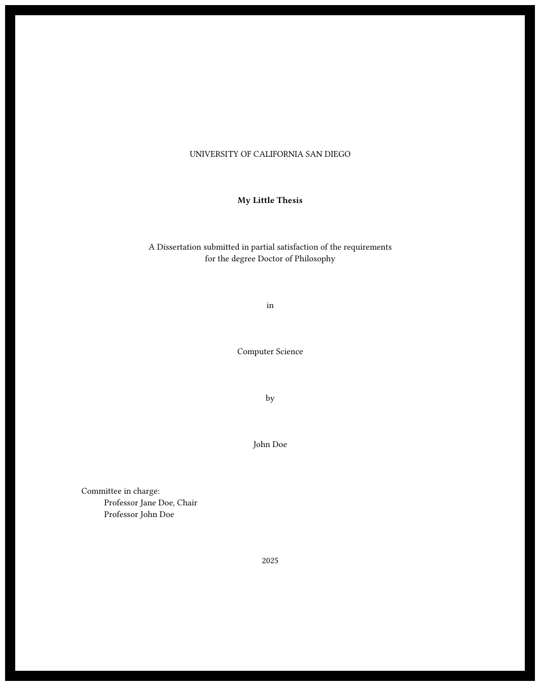

<h1>UCSD Thesis Template for Typst</h1>
<p align="center" width="100%">
<a href="example.pdf"></a>

<i>Checkout the generated example by clicking the preview above.</i>

The thesis follows the [UCSD guidelines](https://grad.ucsd.edu/_files/academics/FormattingManual2023-24updated4.3.24.pdf).<br>
Created using Typst v13.0.

</p>

Supports:  

1. Simple template that auto updates dates, student/comittee names
2. Dedication page (Optional)
3. Epigraph page (Optional)
4. List of figures (Optional)
5. List of tables (Optional)


<br clear="right"/>

### Example usage


```typ
#import "ucsd_thesis.typ": ucsd_thesis

#show: ucsd_thesis.with(
  subject: "Computer Science",
  author: "Potato Salad",
  title: "My Little Thesis",
  degree: "Doctor of Philosophy",
  committee: (
    (title: "Professor", name: "Alan Turing", chair: true),
    (title: "Professor", name: "Ada Lovelace", chair: false),
    (title: "Professor", name: "John von Neumann", chair: false),
    (title: "Professor", name: "Charles Babbage", chair: false),
  ),
  
  abstract: lorem(250),
  acknowledgement: "Add any acknowledgements here.",
  
  enable_list_of_figures: false,
  enable_list_of_tables: false,

  introduction: "This is the introduction.",
)

= My Chapter
#lorem(250)

= Conclusion
Conslusion goes here.
```

## Reference

<pre>
#show: ucsd_thesis.with(
  <a href="#subject"><b>subject</b></a>: <a target="_blank" href="https://typst.app/docs/reference/foundations/str/">str</a> | <a target="_blank" href="https://typst.app/docs/reference/foundations/content/">content</a>,
  <a href="#author"><b>author</b></a>: <a target="_blank" href="https://typst.app/docs/reference/foundations/str/">str</a> | <a target="_blank" href="https://typst.app/docs/reference/foundations/content/">content</a>,
  <a href="#title"><b>title</b></a>: <a target="_blank" href="https://typst.app/docs/reference/foundations/str/">str</a> | <a target="_blank" href="https://typst.app/docs/reference/foundations/content/">content</a>,
  <a href="#degree"><b>degree</b></a>: <a target="_blank" href="https://typst.app/docs/reference/foundations/str/">str</a> | <a target="_blank" href="https://typst.app/docs/reference/foundations/content/">content</a>,
  <a href="#committee"><b>committee</b></a>: <a target="_blank" href="https://typst.app/docs/reference/foundations/dictionary/">dict</a> ,
  <a href="#abstract"><b>abstract</b></a>: <a target="_blank" href="https://typst.app/docs/reference/foundations/none/">none</a> | <a target="_blank" href="https://typst.app/docs/reference/foundations/str/">str</a> | <a target="_blank" href="https://typst.app/docs/reference/foundations/content/">content</a>
  <a href="#dedication"><b>dedication</b></a>: <a target="_blank" href="https://typst.app/docs/reference/foundations/none/">none</a> | <a target="_blank" href="https://typst.app/docs/reference/foundations/str/">str</a> | <a target="_blank" href="https://typst.app/docs/reference/foundations/content/">content</a>,
  <a href="#acknowledgement"><b>acknowledgement</b></a>: <a target="_blank" href="https://typst.app/docs/reference/foundations/none/">none</a> | <a target="_blank" href="https://typst.app/docs/reference/foundations/str/">str</a> | <a target="_blank" href="https://typst.app/docs/reference/foundations/content/">content</a>,
  <a href="#epigraph"><b>epigraph</b></a>: <a target="_blank" href="https://typst.app/docs/reference/foundations/none/">none</a> | <a target="_blank" href="https://typst.app/docs/reference/foundations/str/">str</a> | <a target="_blank" href="https://typst.app/docs/reference/foundations/content/">content</a>,
  <a href="#abbrv"><b>abbrv</b></a>: <a target="_blank" href="https://typst.app/docs/reference/foundations/none/">none</a> | <a target="_blank" href="https://typst.app/docs/reference/foundations/dictionary/">dict</a> ,
  <a href="#vita"><b>vita</b></a>: <a target="_blank" href="https://typst.app/docs/reference/foundations/none/">none</a> | <a target="_blank" href="https://typst.app/docs/reference/foundations/str/">str</a> | <a target="_blank" href="https://typst.app/docs/reference/foundations/content/">content</a>,
  <a href="#publications"><b>publications</b></a>: <a target="_blank" href="https://typst.app/docs/reference/foundations/none/">none</a> | <a target="_blank" href="https://typst.app/docs/reference/foundations/str/">str</a> | <a target="_blank" href="https://typst.app/docs/reference/foundations/content/">content</a>,
  <a href="#introduction"><b>introduction</b></a>: <a target="_blank" href="https://typst.app/docs/reference/foundations/none/">none</a> | <a target="_blank" href="https://typst.app/docs/reference/foundations/str/">str</a> | <a target="_blank" href="https://typst.app/docs/reference/foundations/content/">content</a>,
  <a href="#enable_field_of_study"><b>enable_field_of_study</b></a>: <a target="_blank" href="https://typst.app/docs/reference/foundations/bool/">bool</a>,
  <a href="#enable_field_of_study"><b>research_topic</b></a>: <a target="_blank" href="https://typst.app/docs/reference/foundations/none/">none</a> | <a target="_blank" href="https://typst.app/docs/reference/foundations/str/">str</a> | <a target="_blank" href="https://typst.app/docs/reference/foundations/content/">content</a>,
  <a href="#enable_list_of_tables"><b>enable_list_of_tables</b></a>: <a target="_blank" href="https://typst.app/docs/reference/foundations/bool/">bool</a>,
  <a href="#enable_list_of_tables"><b>enable_list_of_figures</b></a>: <a target="_blank" href="https://typst.app/docs/reference/foundations/bool/">bool</a>,
  <b>doc</b>,
)
</pre>

<!--AUTO-GENERATED-DOCS-BEGIN-->
## Arguments

### `subject`
Subject of the thesis


*Default Value:* `"Computer Science"`

### `author`
Author of the thesis


*Default Value:* `"John/Jane Doe"`

### `title`
Title of the thesis


*Default Value:* `"My Little Thesis"`

### `degree`
Degree of the thesis


*Default Value:* `"Doctor of Philosophy"`

### `committee`
Committee members as dict in the order of appearance
  If a member is the chair, set chair to true
  Fields: title, name, chair


*Default Value:* `(
    (title: "Professor", name: "Jane Doe", chair: true`

### `abstract`
Abstract of the thesis. Omitted if none


*Default Value:* `none`

### `dedication`
Dedication of the thesis. Omitted if none


*Default Value:* `none`

### `acknowledgement`
Acknowledgement of the thesis. Omitted if none


*Default Value:* `none`

### `epigraph`
Epigraph of the thesis. Omitted if none


*Default Value:* `none`

### `abbrv`
List of abbreviations. Omitted if none
  The list will be sorted by the abbreviation.
  
  Example:
  (
    "UCSD": "University of California San Diego",
    "PhD": "Doctor of Philosophy"
  )


*Default Value:* `none`

### `vita`
Vita of the author. Omitted if none


*Default Value:* `none`

### `publications`
Publications of the author. Omitted if none


*Default Value:* `none`

### `introduction`
Introduction of the thesis. Omitted if none


*Default Value:* `none`

### `enable_field_of_study`
Enable field of study section


*Default Value:* `false`

### `research_topic`
Research Topic for Field of Study


*Default Value:* `none`

### `enable_list_of_tables`
Enables List of Table page


*Default Value:* `true`

### `enable_list_of_figures`
Enables List of Table page


*Default Value:* `true`


## State Variables

### `ut_prof_indent`
chp => chapter
fig => figure
spc => spacing
mjr => major


*Default Value:* `1cm`

### `ut_otln_new_chp_spc`
Spacing before the first entry of the chapter in the outline


*Default Value:* `1em`

### `ut_otln_chp_primary_spc`
Spacing between the chapter number and the chapter title in the outline


*Default Value:* `6em`

### `ut_otln_chp_secondary_spc`
Additional indentation of sub-headings for each level in the outline


*Default Value:* `3em`

### `ut_toc_mjr_spc`
Spacing between the major entries in the table of contents


*Default Value:* `2em`

### `ut_otln_leading_spc`
Leading of the outline (table of contents, list of figures, etc.)


*Default Value:* `1em`

### `ut_abbrv_columns`
Columns for the list of abbreviations. The first column is for the abbreviation and the second column is for the full form.


*Default Value:* `(0.25fr, 1fr`

<!--AUTO-GENERATED-DOCS-END-->

---
Copyright &copy; 2024 Suyash Mahar. All rights reserved.
